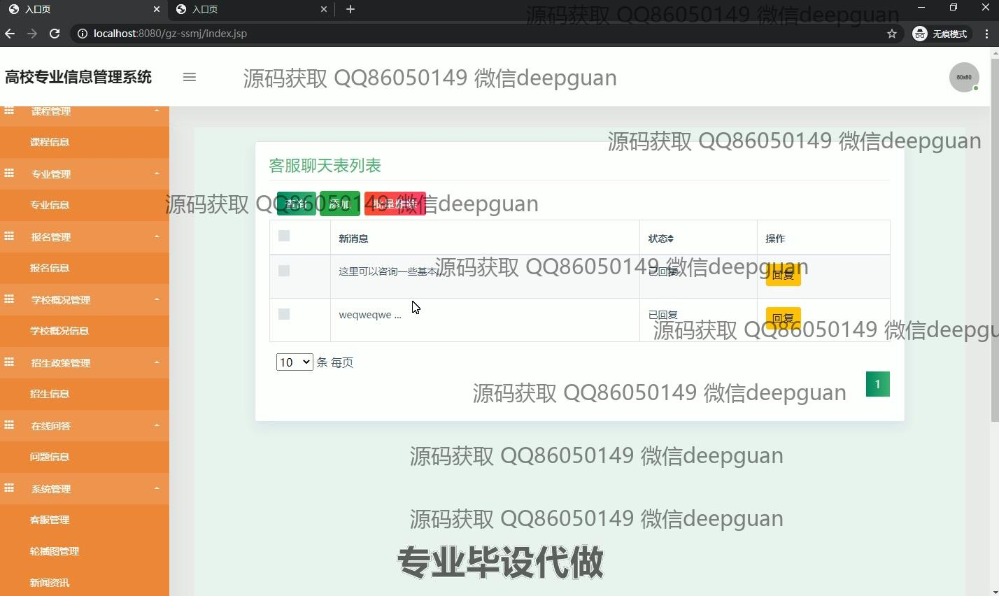

<h1 align="center">高校专业信息管理系统设计与实现</h1>

## 简介
高校专业信息管理系统：角色分为管理员与学生；功能涵盖登录注册、信息录入与管理、专业报名、在线问答和数据分析，优化信息查询与交互体验。    --计算机毕业设计源码；毕设源码；java毕业设计源码

## 联系方式

<h3 align="center">获取完整代码与数据库文件 + 微信：deepguan QQ: 86050149 QQ群: 783742310</h3>

<h3 align="center">可帮忙远程部署 包运行成功！提供远程部署、修改代码、设计文档指导、代码讲解等服务！</h3>

## 功能介绍（完整见运行截图）
管理员：基本功能包括登录、注册和退出，支持多角色系统访问。用户可以访问和操作个人信息管理、学生信息管理、课程信息管理、专业信息管理等模块。通过系统，管理员能够执行查询、添加、修改和删除操作，进行批量数据管理，并使用数据分析工具进行统计和优化。此外，管理员还可以管理在线问答和报名信息模块，确保学生与管理者之间的有效交流与信息同步。

学生：学生通过系统进行账户注册、登录和退出，能够查看和更新个人信息。学生可以访问专业信息管理系统中的课程信息、专业详情、培养目标、就业前景等模块，进行专业选择和报名。系统也提供在线问答模块，学生可以提交问题并获取回复，与学校管理员或相关教师进行互动。此外，学生可以通过系统导航查询学校动态，如学校概况、招生政策、新闻资讯等，实现信息的快速获取和共享。

## 运行截图

本代码来源于网络,仅供学习参考使用!

